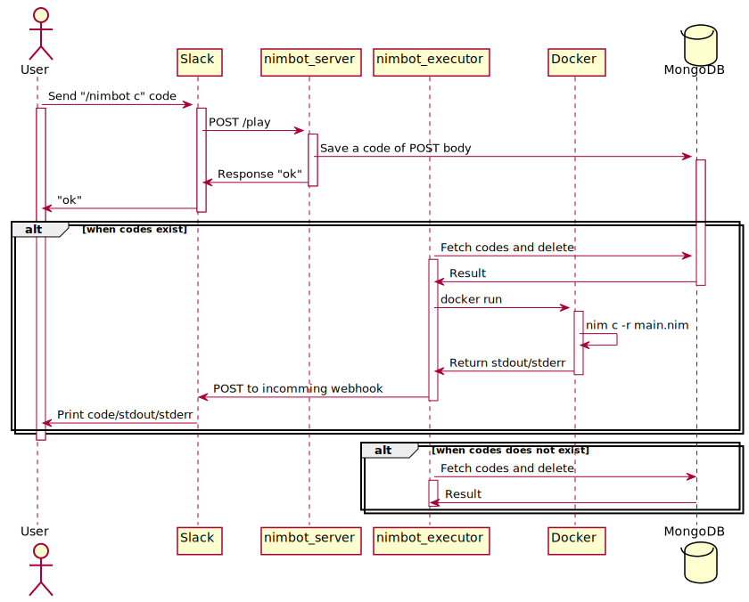

======
nimbot
======

Slackbot for Nim user.

|image-data-flow|

Usave
=====

.. code-block:: shell

   docker-compose -f compiler.yml build
   docker-compose up

Starts for production.

.. code-block:: shell

   docker-compose -f compiler.yml build
   docker-compose -f .github/build.yml build
   docker-compose -f docker-compose.yml -f prd.yml up

