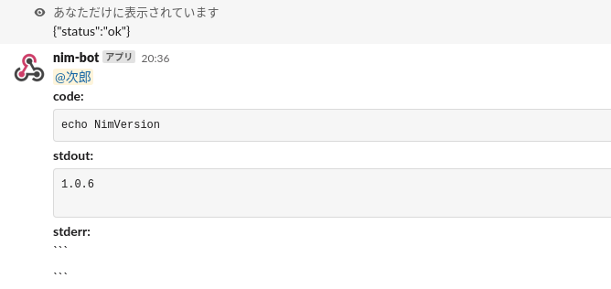
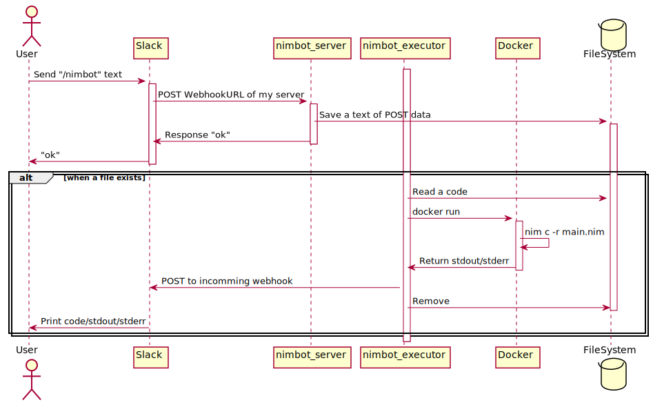
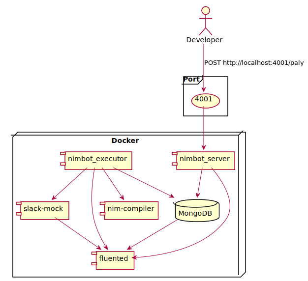

======
nimbot
======

Slackのチャットメッセージを読み取ってNimのコードをコンパイルして実行し、その結果
をSlackに返却するBotです。

|image-demo-top|

.. contents:: 目次

使い方
======

Slackの ``nimbot`` チャンネルで、チャット欄に以下のテキストを入力して送信します
。

::

  /nimbot c

  ```
  echo NimVersion
  ```


これは [Nim]_ のコンパイラのバージョンを出力する Nim のコードです。
Slackのコードブロック記法内に、任意の Nim のコードを記載できます。

また、以下のようにチャットを送信することで、Nim公式リポジトリの devel ブランチ最
新のコンパイラでコードを実行することが可能です。

::

  /nimbot c devel

  ```
  echo NimVersion
  ```

開発
====

前提条件
--------

以下のツールが必要です。

* docker
* docker-compose

このBotはNimで書かれているので、Nimのコンパイラもあったほうが良いです。
しかしながら、Botをビルドして動作させるだけなら上記の2つだけで動作します。

本番検証用には以下のツールが必要です。

* `direnv <https://github.com/direnv/direnv>`_

システム構成図
--------------

ローカル環境のシステム構成は以下。

|image-system|

処理フロー
----------

Slackの [Slash-Commands]_ を使用してNimのコードを送信します。

送信すると、サーバ側の ``nimbot_server`` の `POST /play` エンドポイントにデータ
がPOSTされます。POSTされたデータをパースし、MongoDBの ``code`` コレクションにド
キュメントが保存されます。保存後、一旦Slackのユーザに ``OK`` というレスポンスが
返却されます。

レスポンス返却後、APIサーバとは別で起動する ``nimbot_executor`` がMongoDBの
``code`` を定期的に確認します。 ``code`` にドキュメントが存在するとき、
``nimbot_executor`` はドキュメント内の ``code`` 要素を取得し、Dockerコンテナを起
動して、コンテナ内でNimのコードをコンパイルして実行します。実行結果の標準出力と
標準エラー出力を取得し、Slackの [Incoming-Webhook]_ にデータをPOSTします。

以下はそのシーケンス図です。

|image-data-flow|

環境の操作
----------

``config.nims`` というファイルに頻出のタスクを定義しています。
Nimコンパイラがインストールされていれば、以下のコマンドでタスクを確認できます。

.. code-block:: shell

   nim --hints:off

開発環境の起動
--------------

以下のコマンドを実行すると開発環境を起動します。

.. code-block:: shell

   docker-compose up

   # あるいは

   nim --hints:off upDev

本番検証環境の起動
--------------

.. code-block:: shell

   nim --hints:off upAll

動作確認方法
------------

起動したら以下のコマンドを実行すると、Botが正常に動作していることが確認できます
。

.. code-block:: shell

   curl -X POST -d 'user_id=test_user&text=ccccc' http://localhost:4001/play

Nimコンパイラをインストールしているなら、以下のコマンドで正常なデータを送信でき
ます。

.. code-block:: shell

   nim --hints:off tests

デプロイ方法
------------

masterブランチが更新されるとCIが起動します。
CIで本番用のDockerイメージをビルドして、DockerHubにPushします。
本番環境では ``docker pull`` してイメージを更新します。

Pull Request
============

Welcome!

LICENSE
=======

MIT

脚注
====

.. [Nim] 効率的で、表現力豊かで、エレガントなプログラミング言語。このBotもこれで書かれている (`Link <https://nim-lang.org/>`_)
.. [Slash-Commands] ``/`` で始まるコマンドでBotと対話的にやり取りをするためのSlackインテグレーション (`Link <https://api.slack.com/interactivity/slash-commands>`_)
.. [Incoming-Webhook] 任意のSlackチャンネルにデータを送信するためのWebhook (`Link <https://slack.com/intl/ja-jp/help/articles/115005265063>`_)





